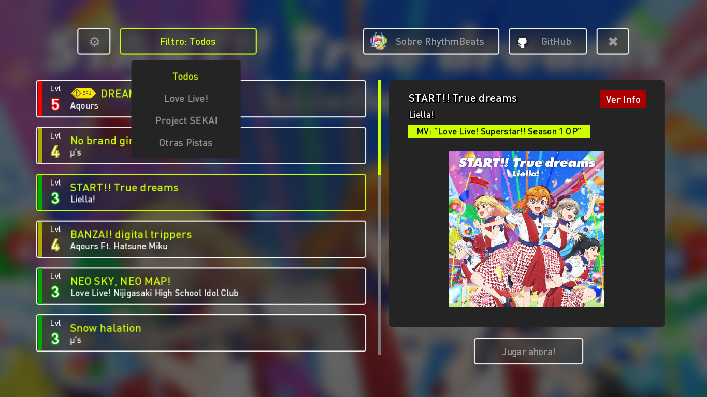
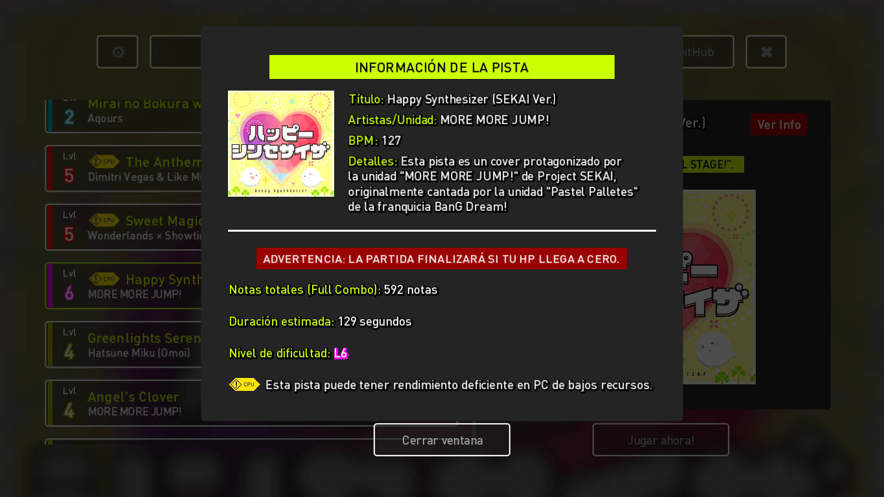
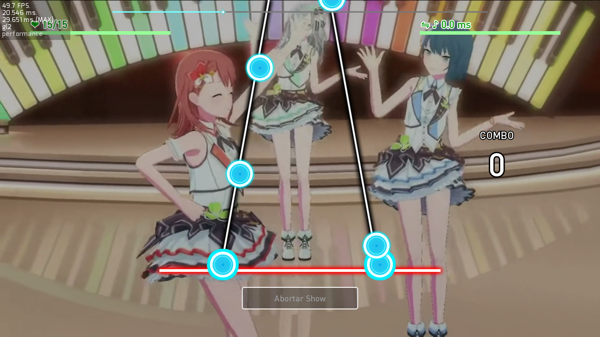
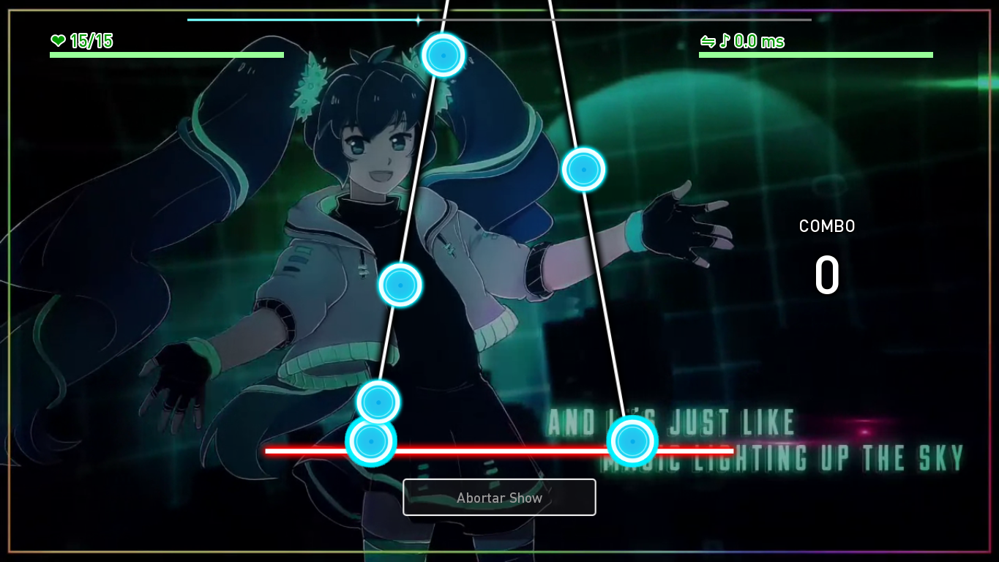

[license]: https://www.gnu.org/licenses/gpl-3.0
[renpy]: https://renpy.org/
[release]: https://github.com/CharlieFuu69/RenPy_RhythmBeats/releases

[renpy-badge]: https://img.shields.io/badge/Ren'Py-v7.4.11-red?style=for-the-badge&logo=python
[license-badge]: https://img.shields.io/badge/License-GPLv3-blue.svg?style=for-the-badge
[license-image]: https://www.gnu.org/graphics/gplv3-with-text-136x68.png
[status-badge]: https://img.shields.io/badge/Status-Beta-000077?style=for-the-badge
[release-badge]: https://img.shields.io/github/v/release/CharlieFuu69/RenPy_RhythmBeats?style=for-the-badge&logo=github


<p align="center">
  
</p>

<h1 align = "center"> Ren'Py RhythmBeats! </h1>

[![license-badge]][license] [![renpy-badge]][renpy] [![release-badge]][release] ![status-badge]

<h5 align = "center">
    <i>[The module has been released and documented - the beta testing phase has started!]</i>
</h5>

<p>
  
  <h3> Welcome to the data repository! </h3>
</p>

I'll tell you a little bit about what it is.

**Ren'Py RhythmBeats is a 2-track rhythm action system that allows you to integrate basic rhythm game mechanics into a visual novel made in Ren'Py. It's rare to find visual novels with rhythm games, but this is a crazy idea that came to my mind because of my fanaticism for rhythm games.

#### BENEFITS RHYTHMBEATS!

**Simplicity:** The rhythm system proposed by **Ren'Py RhythmBeats!** is minimalistic and can be played easily by almost anyone.
** Unusual:** In visual novels, such mini-games are rarely seen. Adding this rhythm system to a visual novel could be revolutionary :3
*You can try it!:** I've created a demo game called **"Ren'Py'Py RhythmBeats! Game "**, which is playable on Windows and Android. The game has a total of 19 songs from Project SEKAI and Love Live!

#### LACKS Ren'Py RHYTHMBEATS!

**May be slow:** Unfortunately, Ren'Py is not a high performance engine, mainly because Python is not a fast language. On a computational level **Ren'Py RhythmBeats!** has no problems, but on a graphical level it can have FPS drops.
** Multitouch:** I'm trying to extend support for touchscreens and Android, but since Ren'Py doesn't have stable Multitouch support, you might be more comfortable playing from a keyboard than a touchscreen.

---

<p align="left">
  
  
  <h3> Downloads and more: </h3>
</p>

*  REN'PY RHYTHMBEATS MODULE RELEASE (BETA VERSION):** **.

  Want to start implementing this rhythm system in your project? Check these URLs!
  * Download the latest version of [Ren'Py RhythmBeats! v1.00.1b](https://github.com/CharlieFuu69/RenPy_RhythmBeats/releases/tag/v1.00.1b_module).
  * Learn how to implement the system in the [Ren'Py RhythmBeats!] documentation (https://github.com/CharlieFuu69/RenPy_RhythmBeats/blob/main/docs/doc_mainpage.md).
  
* **REN'PY RHYTHMBEATS! DEMO GAME**.

  Want to spend some time playing Ren'Py RhythmBeats demo game, it has more than 10 songs with 2DMV!
  Download the latest version of the game (Windows or Android) [at this link](https://github.com/CharlieFuu69/RenPy_RhythmBeats/releases/latest)! ** **Download now!
  **Don't know how to play DEMO? Find out more details [here](DETAILS_DEMO.md)!

---
### Ren'Py RhythmBeats! Game" image gallery:

You might want to see what the demo looks like before you play the game. Here are some sample screenshots :3

<p align="center">
  
  
  <br>
  
  
  <br>
  
  
  <br>
  
  
  <br>
  
  
</p>

---

### Journal of recent activity:
```   
[10/02/2023 03:47 GMT -3]:
    - I've posted a gallery of images from the "Ren'Py'Py RhythmBeats! Game", a demo game of this
      repository.
    - I confirm that the next game update will include 2 new songs for the game.
    
[19/02/2023 04:05:05 GMT -3]:
    - I have completed the rollout of the new global update v1.01.0b.
    - The game "Ren'Py RhythmBeats!" now has an experimental port for Android.
    
[22/02/2023 20:17:17 GMT -3]:
    - I will try to recalibrate the songs, as I noticed some delays in the beatmaps.
      This recalibration will be reflected in an upcoming in-game update.
    - I received a request for the translation of the Ren'Py RhythmBeats content into other languages :3
      languages :3
      I will need to update the documentation as the module has received major changes.
```

---
### licenses:
[![license-image]][license]].

This demo/module is distributed under license **[GPL v3.0](https://www.gnu.org/licenses/gpl-3.0)**.

If you want to use or modify this project, I would appreciate it if you could give me credit by attaching the URL of this repository :3

