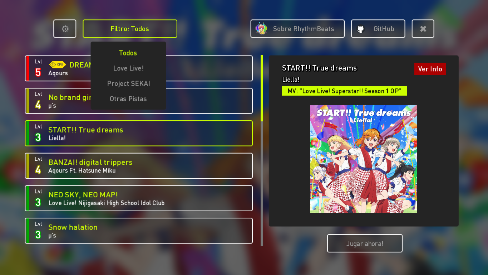
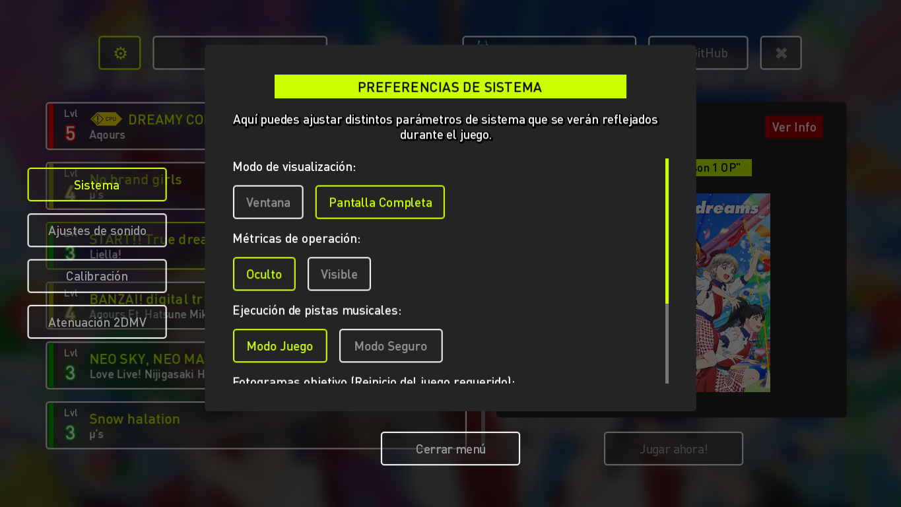
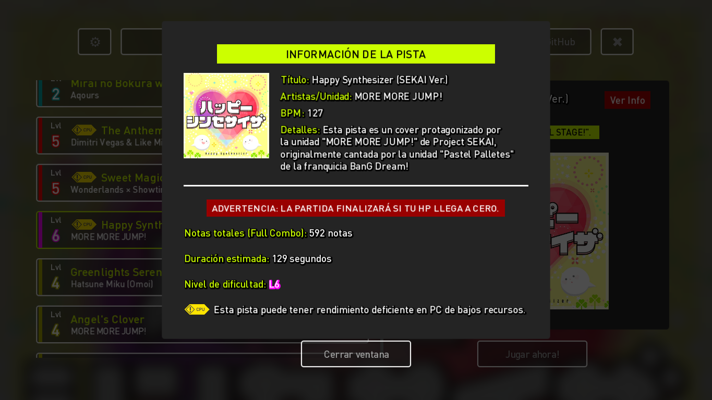
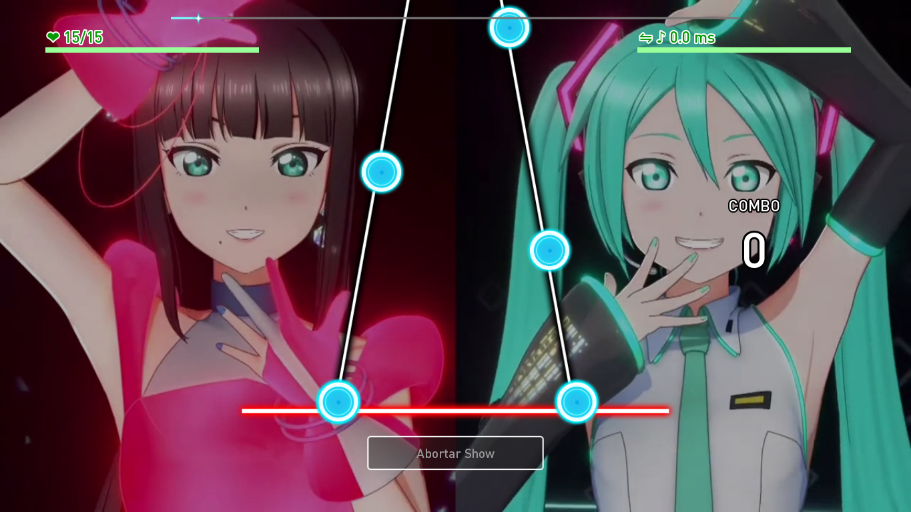
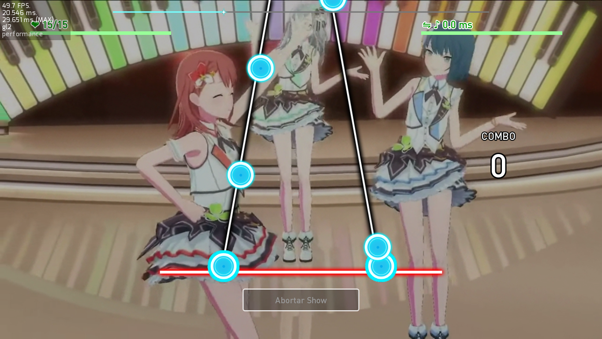
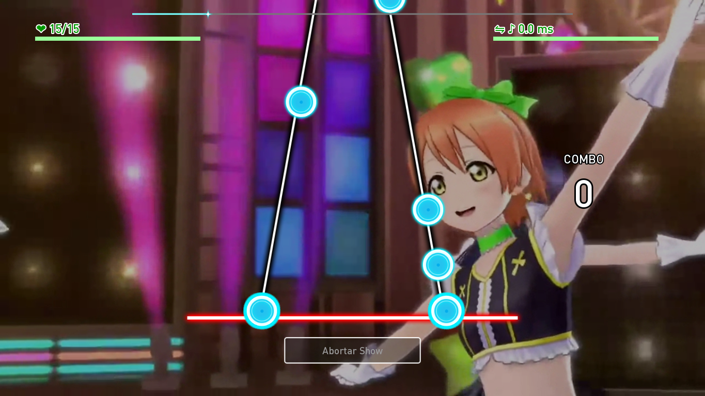
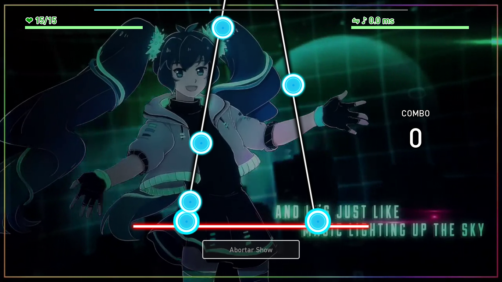
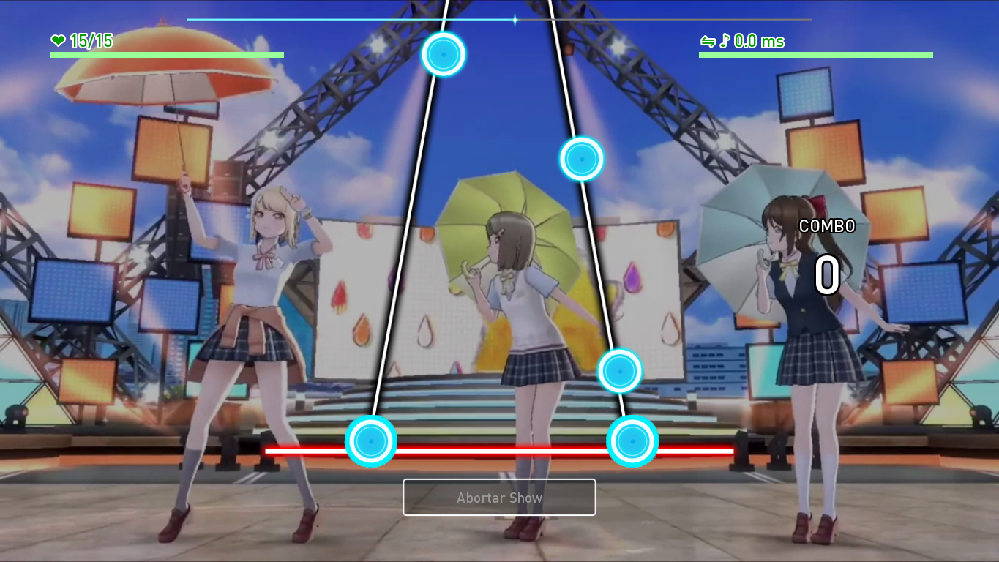
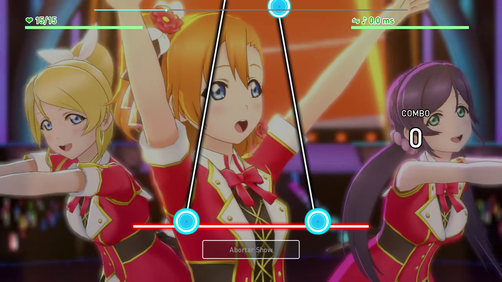

[license]: https://www.gnu.org/licenses/gpl-3.0
[renpy]: https://renpy.org/
[release]: https://github.com/CharlieFuu69/RenPy_RhythmBeats/releases

[renpy-badge]: https://img.shields.io/badge/Ren'Py-v7.4.11-red?style=for-the-badge&logo=python
[license-badge]: https://img.shields.io/badge/License-GPLv3-blue.svg?style=for-the-badge
[license-image]: https://www.gnu.org/graphics/gplv3-with-text-136x68.png
[status-badge]: https://img.shields.io/badge/Status-Beta-000077?style=for-the-badge
[release-badge]: https://img.shields.io/github/v/release/CharlieFuu69/RenPy_RhythmBeats?style=for-the-badge&logo=github


<p align="center">
  
</p>

<h1 align = "center"> Ren'Py RhythmBeats! </h1>

[![license-badge]][license] [![renpy-badge]][renpy] [![release-badge]][release] ![status-badge]

<h5 align = "center">
    <i>[Модуль был выпущен и документирован - началась фаза бета-тестирования!]</i>
</h5>

<p>
  
  <h3> Добро пожаловать в хранилище данных!</h3>
</p>

Я расскажу вам немного о том, что это такое.

**Ren'Py RhythmBeats - это 2-трековая система ритм-экшена, которая позволяет интегрировать базовую механику ритм-игры в визуальную новеллу, сделанную в Ren'Py. Редко можно встретить визуальные романы с ритм-играми, но это сумасшедшая идея, которая пришла мне в голову из-за моего фанатизма к ритм-играм.

#### ПРЕИМУЩЕСТВА REN'PY RHYTHMBEATS!

* **Простота:** Система ритмов, предложенная **Ren'Py RhythmBeats!** минималистична, и в нее может легко играть практически каждый.
* Необычно:** В визуальных романах редко встречаются подобные мини-игры. Добавление этой ритм-системы в визуальную новеллу может стать революционным :3
* Вы можете попробовать!:** Я создал демо-игру под названием **"Ren'Py'Py RhythmBeats! Game "**, в которую можно играть на Windows и Android. Всего в игре 19 песен из Project SEKAI и Love Live!

#### НЕДОСТАТКИ REN'PY RHYTHMBEATS!

* **Может быть медленным:** К сожалению, Ren'Py не является движком с высокой производительностью, в основном потому, что Python не является быстрым языком. На вычислительном уровне **Ren'Py RhythmBeats!** не имеет проблем, но на графическом уровне у него могут быть падения FPS.
* Multitouch:** Я пытаюсь расширить поддержку сенсорных экранов и Android, но поскольку Ren'Py не имеет стабильной поддержки Multitouch, возможно, вам будет удобнее играть с клавиатуры, чем с сенсорного экрана.

---

<p align="left">
  
  
  <h3> Загрузки и многое другое: </h3>
</p>

* РЕЛИЗ МОДУЛЯ REN'PY RHYTHMBEATS (БЕТА-ВЕРСИЯ):** **.

  Хотите начать внедрять эту систему ритмов в свой проект? Проверьте эти URL!
  * Скачайте последнюю версию [Ren'Py RhythmBeats! v1.00.1b](https://github.com/CharlieFuu69/RenPy_RhythmBeats/releases/tag/v1.00.1b_module).
  * Узнайте, как реализовать систему в документации [Ren'Py RhythmBeats!](https://github.com/CharlieFuu69/RenPy_RhythmBeats/blob/main/docs/doc_mainpage.md).
  
* * **REN'PY RHYTHMBEATS! ДЕМО-ИГРА**.

  Хотите провести некоторое время, играя в демо-игру Ren'Py RhythmBeats, в ней более 10 песен с 2DMV!
  Скачайте последнюю версию игры (Windows или Android) [по этой ссылке](https://github.com/CharlieFuu69/RenPy_RhythmBeats/releases/latest)!** ** **Скачайте прямо сейчас!
  * Не знаете, как играть в DEMO? Узнайте подробности [по этой ссылке](DETAILS_DEMO.md)!**

---
### Ren'Py RhythmBeats! Game" галерея изображений:

Возможно, вы захотите посмотреть, как выглядит демо-версия игры, прежде чем играть в нее. Вот несколько образцов скриншотов :3

<p align="center">
  
  
  <br>
  
  
  <br>
  
  
  <br>
  
  
  <br>
  
  
</p>

---

### Журнал последних действий:
```   
[10/02/2023 03:47 GMT -3]:
    - Я разместил галерею изображений из "Ren'Py'Py RhythmBeats! Game", демо-игры этого
      репозитория.
    - Я подтверждаю, что следующее обновление игры будет включать 2 новые песни для игры.
    
[19/02/2023 04:05 GMT -3]:
    - Я завершил работу по развертыванию нового глобального обновления v1.01.0b.
    - Игра "Ren'Py RhythmBeats!" теперь имеет экспериментальный порт для Android.
    
[22/02/2023 20:17 GMT -3]:
    - Я попытаюсь откалибровать песни, так как я заметил некоторые задержки в битмапах.
      Эта перекалибровка будет отражена в ближайшем внутриигровом обновлении.
    - Мне был отправлен запрос на перевод контента Ren'Py RhythmBeats на другие языки :3
      языки :3
      Мне нужно будет обновить документацию, так как модуль получил серьезные изменения.
```

---
### Лицензии:
[![license-image]][лицензия]].

Эта демо-игра/модуль распространяется по лицензии **[GPL v3.0](https://www.gnu.org/licenses/gpl-3.0)**.

Если вы хотите использовать или модифицировать этот проект, я буду признателен, если вы укажете мою заслугу, прикрепив URL этого репозитория :3

